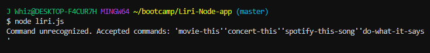

# Liri-Node-app

EXAMPLE COMMAND:

`node liri.js <command> <search term>`

Attach a search term after one of the following command codes ( 'movie-this', 'concert-this', 'spotify-this-song') and info related to the search term will be returned.

For the'do-what-it-says' command, it will run whatever is entered in the random.txt file if it follows this format: <movie-this/concert-this/spotify-this-song>,<search term>.

If you do not enter a command at all, you will get an error that lists accepted commands.

Tech used: node.js
Libraries: npmjs.com, axios, moment, node-spotify-api, omdb, bandsintown

If there are any questions about this project, please contact jandy@uw.edu.

Thank you to Joe, Denis, Trae, Tony, Jonathan, Jered, and Paul for all your help!
